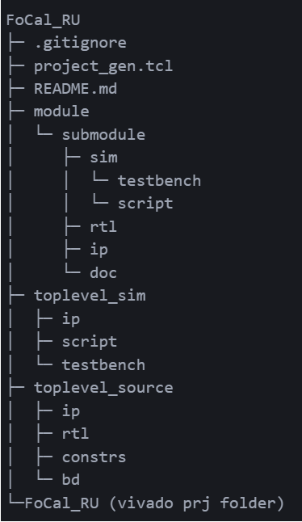

# 使用git管理vivado工程
## 动机
* 固件版本经常需要迭代，需要版本控制，使用压缩包占用内存大，不方便管理
* 大项目需要多人协作，需要版本控制
* 你有多个设备，在家开发/在实验室开发，需要同步工程
## 方法
* 良好的文件结构，只保留项目源文件如ip核，rtl代码，testbench，脚本，忽略工程文件，过程文件
* 使用tcl脚本和源文件重建工程
* 使用git管理源文件和脚本
## 体验使用tcl重建工程
[简单测试项目](https://github.com/ShoulongLinn/vivado_git)
## 具体步骤（以FoCal_RU为例）
1. 创建工程文件夹结构
   *    
   * 隔离源文件和工程文件
   * 如图给出一个大型工程FoCal_RU的文件结构
   * 项目文件夹：FoCal_RU（顶层项目文件夹）
   * 工程文件夹：FoCal_RU（vivado工程文件夹）
   * 源文件夹：modules，toplevel_source,top_level_sim
   * 工程重建脚本: project_gen.tcl
2. 在vivado中新建工程，工程目录选择FoCal_RU（vivado工程文件夹）
3. 在源文件夹中添加源文件rtl，ip
4. 在vivado中添加源文件
5. 在vivado中生成工程重建tcl脚本
   * File->Write Project Tcl
   * 选择项目顶层文件夹FoCal_RU
   * 保存为project_gen.tcl
6. 删除工程文件夹中的工程文件（删除整个FoCal_RU工程文件夹）
     * FoCal_RU.xpr
     * FoCal_RU.cache
     * FoCal_RU.hw
     * FoCal_RU.ip_user_files
     * FoCal_RU.sim
     * FoCal_RU.srcs
     * FoCal_RU.xpr
     * FoCal_RU.runs
     * FoCal_RU.sdk
7. git管理工程
    * git init
    * git add .
    * git commit -m "first commit“
    * ...
8. 工程重建
  * 克隆工程
  * 打开vivado tcl console
  * cd 到FoCal_RU项目文件夹
  * source project_gen.tcl
  * 完成工程重建
9. 值得注意的是，例子中项目文件夹与工程文件夹同名，注意区分
    * 项目文件夹为储存源文件的文件夹
    * 工程文件夹为vivado工程文件夹
